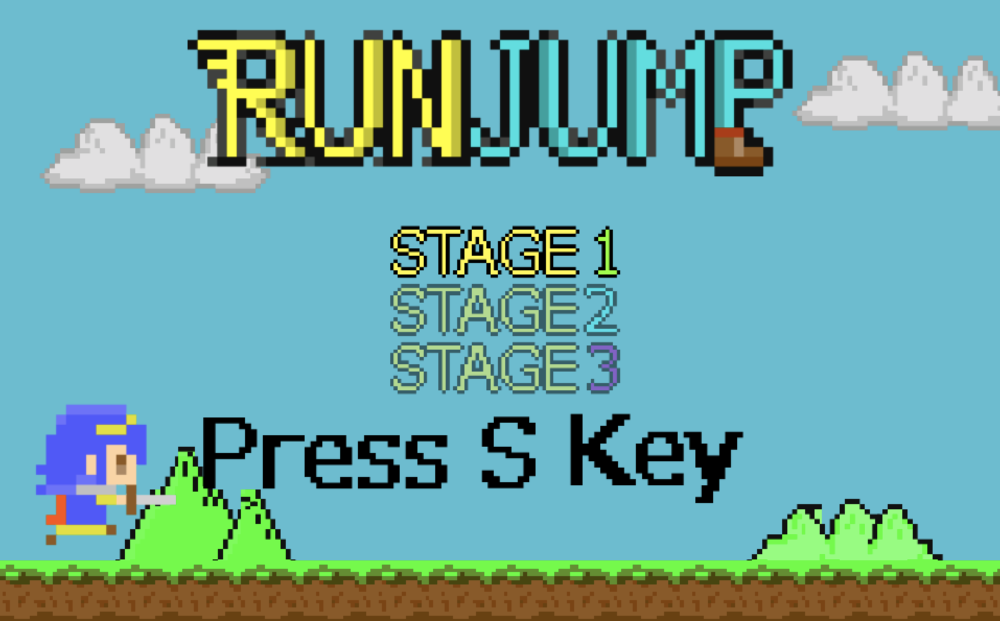
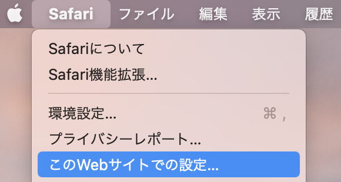

# RunJump
## 概要
横スクロールの2Dアクションゲームです。  
全3面で各ステージの最後にいるボスを倒すとステージクリアです。

## ゲームの遊び方
WebGL版を以下のように公開しています。  
[遊びたい方はこちら](https://nube266.github.io/run_jump_webgl/)

### 操作方法
- S: ゲームスタート  
- A: 攻撃（球を飛ばす）  
- Space: ジャンプ  

### GAME OVER
- 画面外に移動  
- 体力(ハート)が0になる  

### ダメージを与える方法
- 踏みつけ(敵を上から踏む)  
  一番ダメージを与えられます。  
  ヘルメットを被っている敵には効きません。  
- 弾を当てる  
  Aボタンで撃つことの可能な遠距離攻撃です。  
  盾を持っている相手には効きません。  
- 頭突き(敵を下から押し上げる)  
  ダメージにはなりません。    
  敵を上に移動させることができます。    

## 推奨環境(動作確認をした環境)
WebGLでゲームが出来る環境ならば他の環境でも問題ないと思います。
- OS: macOS Big Sur  
- ブラウザ: Safari  
- 画面を最大化すること推奨。  
- 音声が再生されない場合は[Safari]→[このWebサイトでの設定]→[自動再生: すべてのメディアを自動再生] 

 

## 開発環境
OS: macOS  
Unityのバージョン: 2018.3.0f2  
